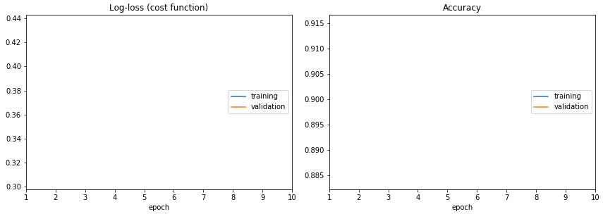

# Live Loss Plot

Don't train deep learning models blindfolded! Be impatient and look at each epoch of your training!

Live training loss plot in [Jupyter Notebook](http://jupyter.org/) for [Keras](https://keras.io/), [PyTorch](http://pytorch.org/) and others. An open source Python package by [Piotr Migdał](http://p.migdal.pl/).

```
from livelossplot import PlotLossesKeras

model.fit(X_train, Y_train,
          epochs=10,
          validation_data=(X_test, Y_test),
          callbacks=[PlotLossesKeras()],
          verbose=0)
```



## Installation

```
pip install git+git://github.com/stared/livelossplot.git
```

## Examples

Look at notebook files with full examples.

## Overview

Text logs are easy, but it's easy to miss the most crucial information: is it learning, doing nothing or overfitting?

Visual feedback allows us to keep track of the training proces.

If you want to get serious - use [Neptune - Machine Learning Lab](https://neptune.ml/) or at least [TensorBoard](https://www.tensorflow.org/programmers_guide/summaries_and_tensorboard).

But what if you just want to train a small model in Jupyter Notebook? Here is a way to do so, using `livelossplot` as a plug&play component.

It started as [this gist](https://gist.github.com/stared/dfb4dfaf6d9a8501cd1cc8b8cb806d2e). Since it went popular, decided to rewrite it as a package.

## To do

* Submit to PyPI
* Add [Bokeh](https://bokeh.pydata.org/) backend
* History saving
* Add connectors to Tensorboard and Neptune

If you want more functionality - open an Issue or even better - prepare a Pull Request.
